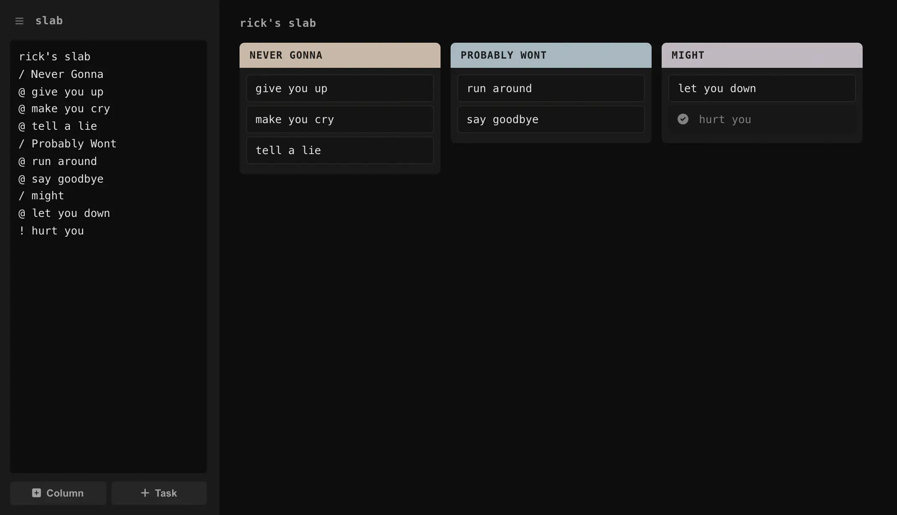

# slab

<p align="center"></p>

A minimalist Kanban board. Text-driven configuration, drag-and-drop columns, single binary.

## How it works

Edit the textarea on the left. The board on the right updates live.

```
slab
/To Do
@ Write docs
! Ship it
/Doing
@ Design UI
/Done
```

- `/` starts a column
- `@` adds an active task
- `!` marks a task done

Drag tasks between columns. Click to toggle done. Every board gets a shareable URL.

## Run

```bash
node server.js
```

Open `http://localhost:3000`.

## Docker

```bash
docker compose up -d
```

The image is also published to `ghcr.io/lkly/slab` on push to `main`.

```bash
docker pull ghcr.io/lklynet/slab:latest
docker run -d -p 3000:3000 -v ./data:/app/data ghcr.io/lkly/slab:latest
```

## Stack

- Vanilla JavaScript frontend, no framework
- Node.js HTTP server, no framework
- SQLite via node:sqlite
- ~3 KB of handwritten CSS
- Minimal Docker image (Alpine)

## License

MIT
